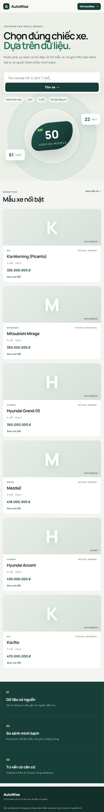

# AutoWise — Vietnam Car RAG MVP

AutoWise là website khám phá và tư vấn ô tô tại Việt Nam, sử dụng React, FastAPI (Python 3.12), PostgreSQL và pgvector. Phiên bản hiện tại đã có website đa trang, dữ liệu 50 mẫu xe, giá VND, bảo hành, đại lý và nguồn tham khảo.



## Trạng thái hiện tại

### Đã hoạt động

- Trang chủ và tìm kiếm nhanh.
- Kho dữ liệu 50 mẫu xe.
- Lọc theo từ khóa, hãng, kiểu xe, số ghế và giá tối đa.
- Trang chi tiết xe.
- So sánh từ 2 đến 3 xe.
- Danh sách 22 đại lý, lọc theo hãng và thành phố.
- Chatbot structured retrieval từ PostgreSQL.
- Responsive cho desktop, tablet và mobile.
- Swagger/OpenAPI cho backend.
- Docker Compose cho toàn bộ hệ thống.

### Chưa triển khai

- LLM tạo câu trả lời tự nhiên.
- Text/image embeddings và vector search.
- Dữ liệu cho bảng `documents`.
- Lưu lịch sử hội thoại.
- Authentication và phân quyền admin.
- CRUD trên giao diện quản trị.
- API chi tiết nguồn dữ liệu.
- Nhận diện hoặc tìm xe tương tự bằng ảnh (Đã hoàn thành bởi Thành viên 3, đóng gói độc lập trong `image_service/`, xem chi tiết tại [image_service/README.md](image_service/README.md)).
- Text/image embeddings và vector search (Đã hoàn thành FAISS 512-dim cho ảnh tại `image_service/indexes/image.index`).

Các route Admin, RAG Settings và Source Detail hiện mới là placeholder giao diện.

## Công nghệ

| Thành phần | Công nghệ |
|---|---|
| Frontend | React, TypeScript, Vite, React Router |
| Backend | FastAPI, Python 3.12, asyncpg, Uvicorn |
| Database | PostgreSQL 17, pgvector 0.8.6 |
| Data pipeline | Python 3, standard library |
| Web server | Nginx |
| Local deployment | Docker Compose |

## Dữ liệu hiện tại

| Bảng | Số bản ghi | Nội dung |
|---|---:|---|
| `cars` | 50 | Xe, mô tả, giá VND và thông số |
| `car_images` | 215 | Ảnh xe đã xác minh trên ổ đĩa |
| `dealers` | 22 | Đại lý của 9 hãng |
| `warranties` | 9 | Chính sách bảo hành theo hãng |
| `sources` | 61 | Nguồn và phạm vi thông tin |
| `documents` | 0 | Dành cho RAG chunks và embeddings |

Dữ liệu nghiệp vụ trong PostgreSQL được lưu bằng tiếng Anh. Giao diện và phản hồi cho người dùng sử dụng tiếng Việt.

## Chạy toàn bộ bằng Docker

Yêu cầu cho first run: Docker Desktop. SQL seed và curated image dataset đã nằm trong repository; không cần Python hoặc corpus raw để dựng phiên bản hiện tại.

```powershell
docker compose up --build -d
```

Sau khi container khởi động:

- Website: [http://localhost:5173](http://localhost:5173)
- Swagger: [http://localhost:5080/swagger](http://localhost:5080/swagger)
- API health: [http://localhost:5080/api/health](http://localhost:5080/api/health)
- PostgreSQL: `localhost:5432`

Kiểm tra trạng thái:

```powershell
docker compose ps
Invoke-RestMethod http://localhost:5080/api/health
Invoke-RestMethod 'http://localhost:5080/api/cars?brand=Honda&limit=10'
Invoke-RestMethod 'http://localhost:5080/api/dealers?brand=Toyota&city=Hanoi'
```

Dừng hệ thống:

```powershell
docker compose down
```

Không dùng `docker compose down -v` nếu muốn giữ dữ liệu PostgreSQL. Tùy chọn `-v` sẽ xóa volume database local.

## Chạy ở chế độ development

Khởi động PostgreSQL:

```powershell
docker compose up -d postgres
```

Chạy backend:

```powershell
py backend/run.py
# hoặc: py -m uvicorn app.main:app --app-dir backend --reload --port 5080
```

Chạy frontend trong terminal khác:

```powershell
Set-Location frontend
npm install
npm run dev
```

Vite sẽ proxy request `/api` đến `http://localhost:5080`.

## Các route giao diện

| Route | Màn hình | Trạng thái |
|---|---|---|
| `/` | Trang chủ | Hoạt động |
| `/cars` | Danh sách và bộ lọc xe | Hoạt động |
| `/cars/:carId` | Chi tiết xe | Hoạt động |
| `/compare?ids=...` | So sánh xe | Hoạt động |
| `/dealers` | Danh sách đại lý | Hoạt động |
| `/chat` | Chatbot | Structured retrieval |
| `/sources/:sourceId` | Chi tiết nguồn | Placeholder |
| `/admin/data` | Quản trị dữ liệu | Placeholder |
| `/admin/rag` | Cấu hình RAG | Placeholder |

Ví dụ:

```text
http://localhost:5173/cars?brand=Toyota
http://localhost:5173/dealers?brand=Mitsubishi
http://localhost:5173/compare?ids=car_34_3,car_57_7
```

## API hiện có

```http
GET  /api/health
GET  /api/cars?query=&brand=&bodyType=&seats=&maxPrice=&limit=
GET  /api/cars/{carId}
GET  /api/dealers?brand=&city=
POST /api/search/text
POST /api/chat
```

`limit` của API xe được giới hạn từ 1 đến 100.

Ví dụ tìm kiếm:

```http
POST /api/search/text
Content-Type: application/json

{
  "query": "SUV gia đình",
  "brand": "Honda",
  "bodyType": "SUV",
  "seats": 5,
  "maxPrice": 1200000000,
  "topK": 5
}
```

Ví dụ chat:

```http
POST /api/chat
Content-Type: application/json

{
  "question": "So sánh Honda CR-V và Mazda CX-5"
}
```

Endpoint chat hiện tìm xe được nhắc đến hoặc fallback sang tìm kiếm PostgreSQL, sau đó trả về template answer và context. Endpoint chưa gọi LLM.

## Kết nối PostgreSQL bằng pgAdmin 4

| Field | Value |
|---|---|
| Host | `127.0.0.1` |
| Port | `5432` |
| Maintenance database | `car_rag` |
| Username | `car_rag` |
| Password | `car_rag_dev` |

Không sử dụng user `postgres` với password cài đặt PostgreSQL trên máy, vì Docker Compose tạo database bằng user `car_rag`.

```sql
SELECT * FROM cars ORDER BY brand_name, display_name;
SELECT * FROM dealers ORDER BY city, name;
SELECT * FROM warranties ORDER BY brand_name;
SELECT * FROM sources ORDER BY source_type, source_id;
```

## Cấu trúc project

```text
RAG-A3/
├── backend/
│   ├── app/
│   │   ├── core/
│   │   │   ├── config.py
│   │   │   └── database.py
│   │   ├── models/
│   │   │   └── schemas.py
│   │   ├── repositories/
│   │   │   ├── car_repository.py
│   │   │   ├── dealer_repository.py
│   │   │   ├── source_repository.py
│   │   │   └── warranty_repository.py
│   │   ├── routers/
│   │   │   ├── cars.py
│   │   │   ├── chat.py
│   │   │   ├── dealers.py
│   │   │   ├── health.py
│   │   │   ├── search.py
│   │   │   ├── sources.py
│   │   │   └── warranties.py
│   │   └── main.py
│   ├── tests/
│   │   ├── conftest.py
│   │   ├── test_cars.py
│   │   ├── test_chat.py
│   │   ├── test_dealers.py
│   │   ├── test_health.py
│   │   └── test_search.py
│   ├── Dockerfile
│   ├── requirements.txt
│   └── run.py
├── database/
├── data/
│   ├── processed/
│   ├── tables_V2.0/
│   └── Confirmed_fronts/
├── docs/
├── frontend/
│   └── src/
│       ├── app/
│       ├── entities/
│       ├── features/
│       ├── pages/
│       └── shared/
├── scripts/
├── docker-compose.yml
└── README.md
```

## Data pipeline

Hai thư mục corpus đầu vào `data/Confirmed_fronts/` và `data/tables_V2.0/` không được commit lên Git vì có tổng dung lượng khoảng 936 MB. Để tạo lại dataset từ đầu, đặt hai thư mục raw này đúng vị trí trên máy local trước khi chạy pipeline. Repository vẫn lưu các output đã xử lý và database seed cần thiết để dựng phiên bản hiện tại.

```powershell
python scripts/build_dataset.py
python scripts/validate_dataset.py
```

Các output chính:

- `data/processed/candidate_models.csv`
- `data/processed/cars.json`
- `data/processed/images_manifest.csv`
- `data/processed/sources.jsonl`
- `data/processed/quality_report.json`
- `database/seed.sql`
- `database/002_add_descriptions.sql`
- `database/003_enrich_missing_data.sql`
- `database/004_seed_dealers.sql`

Các script PostgreSQL trong `/docker-entrypoint-initdb.d` chỉ tự chạy khi volume database được tạo lần đầu. Với volume đã tồn tại, cần chạy migration tương ứng theo cách thủ công hoặc dùng migration runner trong tương lai.

First-run database được kiểm tra tự động với expected counts: 50 xe, 215 ảnh, 22 đại lý, 9 bảo hành, 61 nguồn và 0 RAG documents. Bảng `documents` cố ý để trống cho indexing pipeline ở giai đoạn tiếp theo. Xem [`database/README.md`](database/README.md) để biết thứ tự SQL, cách kiểm tra và cách áp dụng migration cho volume đã tồn tại.

## Build và kiểm tra

```powershell
# Chạy bộ test backend (Python / pytest)
py -m pytest backend/tests -v -p no:asyncio

# Build frontend
Set-Location frontend
npm run build

Set-Location ..
docker compose up -d --build api web
```

## Tài liệu thiết kế

- [`docs/spec.md`](docs/spec.md): phạm vi sản phẩm và release plan.
- [`docs/database_strucutre.md`](docs/database_strucutre.md): database, ERD và index.
- [`docs/artechture.md`](docs/artechture.md): kiến trúc và RAG flow.
- [`docs/RAG.md`](docs/RAG.md): business logic, orchestration, API và lộ trình RAG tổng thể.
- [`docs/RAG_text.md`](docs/RAG_text.md): ingestion, text embedding, hybrid retrieval và grounded answer.
- [`docs/RAG_image.md`](docs/RAG_image.md): image embedding, visual retrieval và multimodal fusion.
- [`docs/feature_spec_home.md`](docs/feature_spec_home.md)
- [`docs/feature_spec_car_catalog.md`](docs/feature_spec_car_catalog.md)
- [`docs/feature_spec_car_detail.md`](docs/feature_spec_car_detail.md)
- [`docs/feature_spec_car_compare.md`](docs/feature_spec_car_compare.md)
- [`docs/feature_spec_dealers.md`](docs/feature_spec_dealers.md)
- [`docs/feature_spec_chatbot.md`](docs/feature_spec_chatbot.md)
- [`docs/feature_spec_source_detail.md`](docs/feature_spec_source_detail.md)
- [`docs/feature_spec_data_admin.md`](docs/feature_spec_data_admin.md)
- [`docs/feature_spec_rag_settings.md`](docs/feature_spec_rag_settings.md)

## Quy tắc dữ liệu quan trọng

- DVM-CAR là dữ liệu thị trường Anh và chỉ được dùng làm nguồn khởi tạo.
- Không dùng giá GBP trong DVM-CAR để trả lời giá tại Việt Nam.
- Giá hiển thị tại Việt Nam phải đến từ `price_vnd_from` và có `price_source_id`.
- Xe lịch sử và xe nhập tư nhân không được mô tả như xe đang phân phối chính hãng.
- Alias không đồng nghĩa với cùng phiên bản kỹ thuật.
- Khi thiếu dữ liệu, giao diện phải hiển thị `Chưa có dữ liệu`, không tự suy đoán.
- Giá và thông số là dữ liệu tham khảo, không phải báo giá đại lý theo thời gian thực.

## Hướng phát triển tiếp theo

1. Tạo dữ liệu cho bảng `documents`.
2. Chọn embedding model tương thích `vector(768)`.
3. Triển khai full-text, vector và hybrid retrieval.
4. Kết nối LLM và kiểm tra citation.
5. Thêm API nguồn, bảo hành và comparison chuyên dụng.
6. Lưu chat sessions và messages.
7. Thêm authentication và trang admin CRUD.
8. Tạo image embeddings `vector(512)` cho tìm kiếm ảnh.

