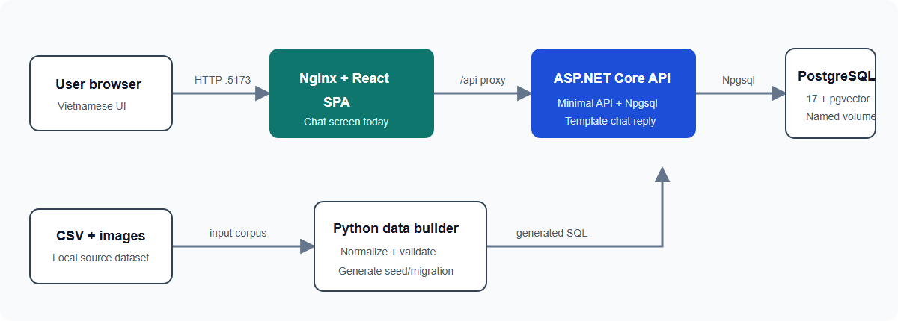
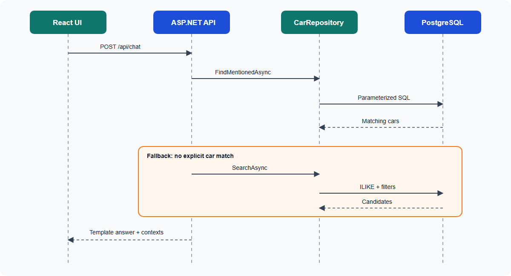
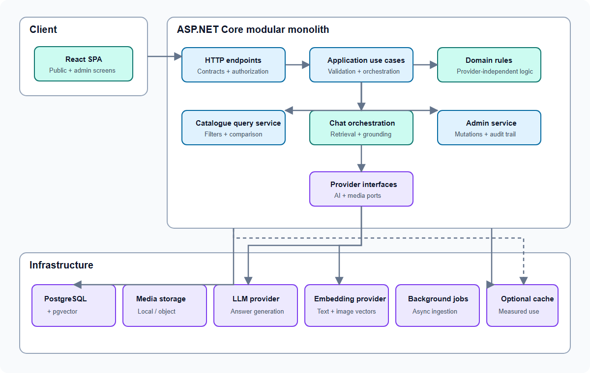
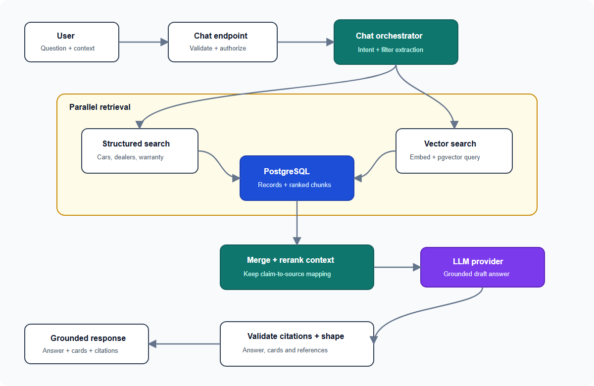
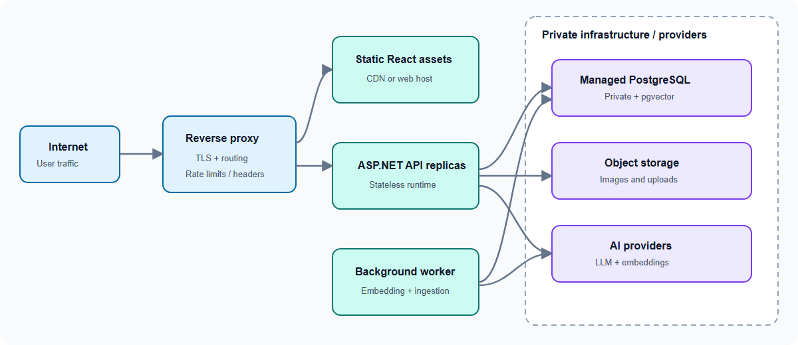

# AutoWise Architecture Review

## 1. Document information

- Product: AutoWise Vietnam Car RAG
- Reviewed: 2026-10-01
- Current style: Dockerized three-service modular monolith
- Target style: Layered modular monolith with asynchronous RAG jobs
- Backend: ASP.NET Core on .NET 10
- Frontend: React + TypeScript + Vite
- Data: PostgreSQL 17 + pgvector

> Filename intentionally follows the requested name `artechture.md`.

## 2. Architecture goals

- Keep the MVP simple enough for one deployment unit per application tier.
- Make every recommendation traceable to database records and sources.
- Separate business rules from HTTP and SQL concerns.
- Allow RAG ingestion and LLM providers to evolve without rewriting catalogue features.
- Keep public read traffic independent from slower embedding and generation jobs.
- Provide a clear path to authentication, admin operations and observability.

## 3. Current runtime architecture



### Current components

#### React frontend

- One `App.tsx` chatbot screen.
- Local in-memory conversation state.
- Calls `/api/health` and `/api/chat`.
- No router, server-state library, authentication or persisted sessions yet.

#### ASP.NET Core API

- Minimal API endpoints in `Program.cs`.
- Direct `CarRepository` registration.
- Raw parameterized SQL through Npgsql.
- Swagger and CORS enabled.
- Chat endpoint performs structured retrieval and returns template text; no LLM is connected.

#### PostgreSQL

- Stores cars, images, sources, warranties and dealers.
- Has pgvector columns reserved for text and image embeddings.
- `documents` is empty, so semantic retrieval is not active.

#### Data builder

- `scripts/build_dataset.py` transforms the source CSV/image corpus.
- Generates processed artifacts and repeatable SQL seed/migration files.
- It is an offline development tool, not a runtime service.

## 4. Current request flow



This is safe as a retrieval prototype but is not yet a complete RAG flow because there is no document ingestion, vector retrieval, prompt construction, LLM generation or citation validation.

## 5. Target logical architecture



## 6. Recommended backend layers

### API layer

Responsibilities:

- Route mapping and versioning.
- Authentication and authorization.
- Request parsing and response serialization.
- Problem Details, rate limits and correlation IDs.
- No SQL and minimal business branching.

### Application layer

Organized by use case rather than database table:

- `SearchCars`
- `GetCarDetail`
- `CompareCars`
- `FindDealers`
- `AskAssistant`
- `UpdateCar`
- `ReindexDocuments`

Responsibilities include orchestration, validation and transaction boundaries.

### Domain layer

Contains stable rules:

- Market-status interpretation.
- Price-label and freshness rules.
- Warranty precedence.
- Comparison-selection limits.
- Recommendation eligibility.

The domain layer must not depend on ASP.NET, Npgsql or a model-provider SDK.

### Infrastructure layer

- PostgreSQL repositories and SQL.
- Embedding/LLM provider implementations.
- Media storage.
- Background jobs.
- Clock and external HTTP clients.

Provider interfaces keep the application testable and avoid locking business logic to one vendor.

## 7. Recommended backend structure

```text
backend/
  AutoWise.sln
  AutoWise.Api/
    Endpoints/
    Middleware/
    Program.cs
  AutoWise.Application/
    Cars/
    Dealers/
    Chat/
    Admin/
    RAG/
  AutoWise.Domain/
    Cars/
    Dealers/
    Warranties/
    Sources/
  AutoWise.Infrastructure/
    Persistence/
    Search/
    AI/
    Jobs/
    Media/
  AutoWise.Contracts/
  AutoWise.Tests.Unit/
  AutoWise.Tests.Integration/
```

For the MVP, these may remain folders inside one API project. Split into projects when boundaries become stable; do not create microservices yet.

## 8. Recommended frontend architecture

```text
frontend/src/
  app/
    router.tsx
    providers.tsx
  pages/
    HomePage/
    CarCatalogPage/
    CarDetailPage/
    ComparePage/
    DealersPage/
    ChatPage/
    SourceDetailPage/
    AdminDataPage/
    RagSettingsPage/
  features/
    car-search/
    car-compare/
    chat/
    dealer-filter/
  entities/
    car/
    dealer/
    source/
    warranty/
  shared/
    api/
    components/
    hooks/
    formatting/
    styles/
```

Recommended frontend decisions:

- Add React Router for route-driven screens.
- Use generated TypeScript API contracts from OpenAPI or a shared schema.
- Use a server-state library only when caching/pagination complexity warrants it.
- Keep filter state in the URL.
- Keep comparison selection in URL plus local storage for continuity.
- Separate API response models from display formatting.
- Preserve the current chatbot visual design as the Chat page shell.

## 9. Target RAG flow



### RAG ingestion flow

1. Detect changed cars, warranties, dealers and sources.
2. Generate deterministic English documents by section.
3. Hash document content.
4. Skip unchanged hashes.
5. Generate 768-dimension embeddings.
6. Upsert the new content and embedding transactionally.
7. Retain job status and errors for the RAG Settings screen.

## 10. API design

### Public APIs

- `/api/v1/cars`
- `/api/v1/cars/{carId}`
- `/api/v1/cars/compare`
- `/api/v1/dealers`
- `/api/v1/sources/{sourceId}`
- `/api/v1/chat/sessions`

### Administrative APIs

- `/api/v1/admin/cars`
- `/api/v1/admin/dealers`
- `/api/v1/admin/warranties`
- `/api/v1/admin/sources`
- `/api/v1/admin/imports`
- `/api/v1/admin/rag/*`

Design rules:

- Version public contracts before production use.
- Use Problem Details with stable application error codes.
- Use consistent pagination envelopes.
- Pass `CancellationToken` through all async operations.
- Keep SQL parameterized.
- Validate request size and file type before reading uploads.
- Generate OpenAPI in CI and detect breaking changes.

## 11. Security model

### Public surface

- Catalogue, detail, comparison, dealer lookup and source viewing are anonymous reads.
- Chat is anonymous for MVP but rate-limited by client/IP policy.

### Restricted surface

- Admin and RAG operations require an authenticated administrator or operator role.
- State-changing endpoints require authorization and audit logging.
- Provider secrets and database credentials come from environment/secret storage.

### Required controls

- Treat retrieved content as untrusted data, never executable instructions.
- Use an allow-list for source URL schemes.
- Sanitize displayed/generated content.
- Limit chat question and uploaded-image sizes.
- Avoid logging prompt content, credentials and personal data by default.
- Do not expose PostgreSQL port 5432 outside the trusted deployment network.

## 12. Deployment architecture

### Local development

Current Docker Compose remains suitable:

- `web` on port 5173.
- `api` on port 5080.
- `postgres` on port 5432.
- Persistent named PostgreSQL volume.

### Production recommendation



- Keep database on a private network.
- Run migrations as a controlled release step.
- Serve media from object storage or a media service.
- Run embedding jobs outside request handlers.
- Use health/readiness probes independently.
- Back up and test restore procedures.

## 13. Observability

Add:

- Structured logs with correlation ID, route, duration and status.
- Database query timing without SQL parameter values.
- Metrics for API latency, error rates and connection-pool saturation.
- Chat metrics for retrieval duration, generation duration, empty retrieval and invalid citations.
- RAG job metrics for queued, completed, skipped and failed documents.
- Traces across API, PostgreSQL and external AI calls when available.

No raw prompt/message logging by default.

## 14. Testing strategy

### Unit tests

- Filter normalization.
- Market-status and price labels.
- Warranty precedence.
- Comparison rules.
- Intent/filter extraction.
- Citation validation.

### Integration tests

- Repositories against disposable PostgreSQL with pgvector.
- API status codes and Problem Details.
- Migration from an empty database.
- Idempotent seed and ingestion behavior.
- Authorization for every admin endpoint.

### End-to-end tests

- Search → detail → compare.
- Brand/city → dealer contact.
- Question → grounded answer → source link.
- Admin edit → re-index → updated retrieval.

## 15. Delivery phases

### Phase 1 — Refactor without behavior change

- Introduce route modules, contracts and repository interfaces.
- Add API integration tests.
- Add React routing while preserving the chatbot screen.

### Phase 2 — Browseable product

- Implement catalogue, detail, comparison, dealer and source screens.
- Add missing public query endpoints.

### Phase 3 — Complete RAG

- Generate documents, select the 768-dimension model and ingest embeddings.
- Implement hybrid retrieval, LLM integration and citation validation.

### Phase 4 — Operations

- Add authentication, admin CRUD, audit history and background jobs.
- Add production deployment, monitoring and backup processes.

### Phase 5 — Multimodal

- Generate 512-dimension image embeddings.
- Add image-similarity retrieval and image-assisted chat.

## 16. Key risks

| Risk | Impact | Mitigation |
|---|---|---|
| Model-level data treated as trim-specific | Incorrect comparisons | Add variants or label all values as model references |
| Unfixed embedding provider | Incompatible 768-vector schema | Decide model before ingestion or migrate dimension explicitly |
| LLM produces unsupported claims | Loss of trust | Structured context, citation validation and no-answer behavior |
| Docker init scripts mistaken for migrations | Existing databases drift | Adopt versioned migrations |
| Single `App.tsx` grows across screens | Frontend becomes hard to maintain | Introduce router and feature/page boundaries now |
| Synchronous embedding jobs block API | Poor reliability | Use a background worker and job status table |
| Public chat abuse | Cost and availability issues | Rate limits, quotas and request-size limits |

## 17. Architecture decisions requested

1. Approve a modular monolith instead of microservices for the MVP.
2. Approve raw Npgsql repositories or choose EF Core for mutation-heavy admin features.
3. Choose the text embedding provider/model compatible with 768 dimensions.
4. Choose the LLM provider abstraction and initial implementation.
5. Choose authentication strategy for administrators.
6. Choose background job technology: hosted service, Hangfire, Quartz or external worker.
7. Choose media storage for production.
8. Decide whether model variants are required before comparison goes live.

