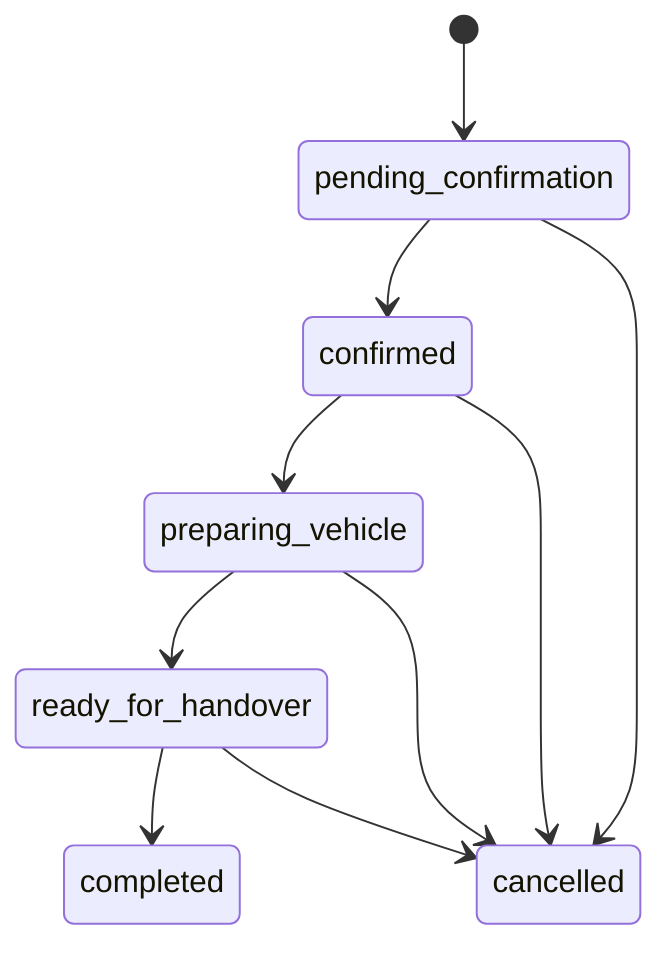
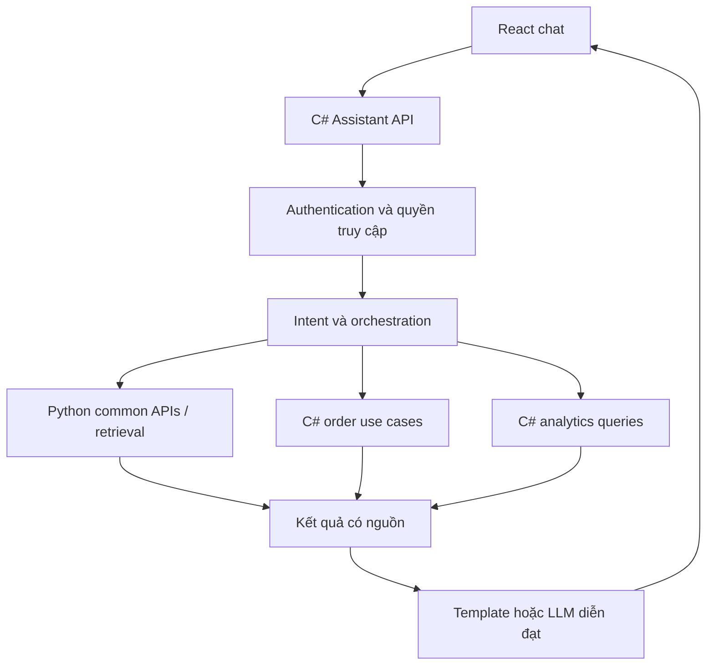

# Đặc tả features C# do bạn owner

Ngày: 2026-10-02. Trạng thái: thiết kế đề xuất, **chưa triển khai**.

## 1. Hướng sản phẩm

Xây dựng module **Quản lý đơn mua xe và trợ lý tra cứu/phân tích kinh doanh**.
Khách theo dõi đơn mua xe; admin vận hành đơn, ghi nhận thanh toán và bàn giao.
Chatbot C# điều phối API nghiệp vụ C# và API common Python để trả lời có căn cứ.

Đơn trong phạm vi này là hồ sơ đặt/mua xe do admin tạo, không phải đơn hàng của
một website thương mại điện tử đầy đủ. MVP không cần giỏ hàng hoặc thanh toán online.
Dữ liệu seed phục vụ demo và kiểm thử; không đại diện giao dịch thực tế.

Luồng demo chính:

1. Admin tạo đơn cho khách, chọn xe từ catalogue Python và ghi giá chốt.
2. Admin xác nhận đơn, ghi nhận thanh toán, cập nhật tiến độ và lịch bàn giao.
3. Khách đăng nhập, xem đơn của mình và hỏi chatbot về tiến độ/số tiền còn lại.
4. Admin xem dashboard, hỏi chatbot về số đơn, giá trị đơn và tiền đã thu.

## 2. Ranh giới ownership

| Phần | Công nghệ/owner | Trách nhiệm |
|---|---|---|
| Common hiện có | Python / nhóm common | Catalogue, xe, đại lý, bảo hành, nguồn, so sánh |
| RAG chung | Python / hai dev RAG | Ingestion, embedding, retrieval và bằng chứng có nguồn |
| Features bạn owner | C# | Khách hàng, đơn hàng, thanh toán, bàn giao, thống kê, chatbot orchestration |
| UI | React/TypeScript | Màn hình khách hàng/admin của module C# và UI common hiện có |

Mọi business rules, API, migrations, tác vụ và orchestration của module bạn owner
nằm trong C#. C# gọi API Python để dùng dữ liệu common; không đọc/ghi trực tiếp
bảng của Python, không xây lại catalogue hoặc ingestion RAG.

Admin trong tài liệu này là **admin nghiệp vụ đơn hàng**, khác màn hình quản trị
catalogue `/admin/data` hiện tại. Không thay đổi ownership màn hình common đó.
Python backend tiếp tục chạy; thêm service C# mới, không khôi phục backend cũ.

## 3. Danh sách feature

| Mã | Feature | Giá trị cho người dùng | Ưu tiên |
|---|---|---|---|
| O-01 | Đăng nhập và phân quyền | Khách chỉ truy cập đơn của mình | MVP |
| O-02 | Admin quản lý đơn | Tạo, xác nhận, tìm và cập nhật đơn | MVP |
| O-03 | Khách theo dõi đơn | Xem xe, giá chốt, thanh toán và tiến độ | MVP |
| O-04 | Ghi nhận thanh toán/hoàn tiền | Theo dõi số tiền đúng theo giao dịch đã xác nhận | MVP |
| O-05 | Quản lý bàn giao | Lịch dự kiến/thực tế và các đơn chậm bàn giao | MVP |
| O-06 | Chatbot tra cứu | Hỏi đơn của mình qua ngôn ngữ tự nhiên | MVP |
| O-07 | Dashboard kinh doanh | Thống kê theo thời gian, xe và đại lý | Giai đoạn 2 |
| O-08 | Chatbot phân tích | Hỏi thống kê qua các tool được kiểm soát | Giai đoạn 2 |

## 4. Các màn hình

| Route React đề xuất | Vai trò | Nội dung chính |
|---|---|---|
| `/login` | Chưa đăng nhập | Đăng nhập, lỗi xác thực, quay lại trang yêu cầu |
| `/account/orders` | Customer | Danh sách đơn, lọc trạng thái, tìm mã đơn |
| `/account/orders/:orderId` | Customer | Xe/giá chốt, thanh toán, timeline, lịch bàn giao |
| `/account/assistant` | Customer | Chat tra cứu và thẻ liên kết tới đơn/xe/nguồn |
| `/admin/orders` | Admin | Tìm/lọc đơn theo mã, khách, trạng thái, đại lý, ngày |
| `/admin/orders/new` | Admin | Chọn khách, đại lý và xe; nhập giá chốt; xem tổng đơn |
| `/admin/orders/:orderId` | Admin | Chi tiết, action trạng thái, giao dịch, lịch và audit |
| `/admin/customers` | Admin | Danh sách, tạo hồ sơ khách và liên kết tài khoản |
| `/admin/analytics` | Admin | KPI, biểu đồ theo kỳ, bảng xe/đại lý |
| `/admin/assistant` | Admin | Chat tra cứu đơn và thống kê theo quyền admin |

Danh sách có pagination phía server. Chi tiết có loading, 404, 403 và retry cho
lỗi kết nối. Form giữ dữ liệu nhập khi lỗi; API validation hiện theo trường.
Cập nhật xung đột trả 409 để người dùng tải lại, không ghi đè im lặng.

Không hiển thị action admin cho khách; backend vẫn kiểm tra quyền độc lập UI.
Nếu khách có nhiều đơn, chatbot hiển thị lựa chọn đơn trước khi trả lời cụ thể.

## 5. Nghiệp vụ đơn hàng

### 5.1 Tạo đơn

MVP: mỗi đơn chứa một xe, số lượng 1; schema có order items để có thể mở rộng sau.
Admin chọn `carId`/`dealerId` từ Python, nhập giá chốt VND và tiền cọc yêu cầu.
Không lấy giá catalogue làm giá giao dịch mặc định mà không xác nhận.

C# kiểm tra xe/đại lý tồn tại qua Python trước khi ghi transaction local. Nếu
Python không truy cập được, báo lỗi và giữ form; không tạo đơn với snapshot đoán.
Không giữ transaction database mở trong lúc gọi Python.

Đơn lưu snapshot tên xe, hãng, đại lý, tên phiên bản nếu đã được xác nhận,
giá chốt và nguồn tham khảo tại thời điểm tạo. `carId` chỉ là tham chiếu ngoài,
không có foreign key xuyên database. Catalogue thay đổi hoặc xóa xe không làm
mất/sửa lịch sử đơn. Không tự suy ra phiên bản từ dữ liệu cấp model.

Khách hàng/xe/giá chốt chỉ sửa khi đơn còn `pending_confirmation` và chưa có giao
dịch đã xác nhận. Qua bước xác nhận, snapshot và giá chốt được cố định trong MVP.
Không xóa cứng đơn hoặc giao dịch; hủy đơn có lý do và lịch sử.

### 5.2 Trạng thái



- `completed` chỉ khi đã bàn giao và thanh toán đủ số tiền cần thu.
- `cancelled` và `completed` là trạng thái cuối trong MVP; không quay ngược tùy ý.
- Hủy đơn có tiền đã thu phải kèm phương án xử lý/hoàn tiền rõ ràng. Số tiền chưa
  hoàn vẫn hiển thị; hủy không tự sinh giao dịch hoàn tiền hoặc xóa thanh toán.
- Mỗi lần đổi trạng thái ghi người thực hiện, thời điểm và lý do.
- Quy tắc chuyển trạng thái nằm trong domain/application C#, không nằm trong LLM.

### 5.3 Thanh toán

Trạng thái thanh toán độc lập trạng thái đơn. MVP là **ghi nhận giao dịch thủ công**,
không thu tiền thật qua ứng dụng và không tích hợp ngân hàng/cổng thanh toán.

Mỗi giao dịch có loại `receipt`/`refund`, trạng thái `pending`/`confirmed`/`failed`,
số tiền dương, mã tham chiếu và người ghi nhận/xác nhận. Chỉ admin xác nhận được.
Giao dịch đã xác nhận bất biến; sửa sai bằng bản ghi điều chỉnh/hoàn tiền có audit.
Không coi câu khách nói “đã chuyển tiền” là bằng chứng giao dịch confirmed.

Công thức trên đơn:

- Tổng đơn = tổng giá chốt × số lượng; MVP chưa tính phí/thuế riêng.
- Đã thu ròng = tổng receipt confirmed − tổng refund confirmed.
- Còn phải thu trên đơn đang hoạt động = max(tổng đơn − đã thu ròng, 0).
- Cọc yêu cầu nằm trong tổng đơn, không cộng thêm lần nữa.
- Không xác nhận receipt khiến số tiền thu vượt tổng đơn trong MVP.
- Refund liên kết receipt gốc; tổng hoàn không vượt số receipt đã xác nhận.
- Đơn đã hủy không hiển thị số dư như khoản phải thu bình thường; hiển thị số tiền
  đang giữ và kế hoạch xử lý. MVP chỉ hỗ trợ hủy hoàn toàn, không tính phí hủy.

Chống ghi nhận hai lần bằng unique mã tham chiếu theo nguồn giao dịch và
idempotency key cho request mutation. Kiểm tra tiền và ghi giao dịch trong cùng
transaction; dùng concurrency control để hai admin không cùng xác nhận vượt hạn mức.

### 5.4 Bàn giao

Lưu lịch dự kiến, lịch thực tế, địa điểm và ghi chú. Mỗi thay đổi lịch có audit;
không thay lịch dự kiến cũ mà mất lịch sử. Nếu chưa có lịch, hiển thị chưa có dữ liệu.
Đơn chậm bàn giao: ngày dự kiến tại Việt Nam đã qua, chưa completed/cancelled.
Chatbot chỉ thông báo lịch trong database, không tự hứa hoặc tự đổi lịch.

## 6. Chatbot orchestration C#



C# owner hội thoại, lựa chọn tool, kiểm tra tham số/quyền, timeout và tổng hợp
câu trả lời. Mỗi tool gọi application service/API đã định nghĩa, không nhận URL
hoặc SQL tự do từ LLM. Khách hàng chỉ được gọi tool phạm vi đơn của mình.

| Tool đề xuất | Dữ liệu | Ví dụ câu hỏi |
|---|---|---|
| `ListMyOrders` | C# theo user đã xác thực | “Tôi đang có những đơn nào?” |
| `GetMyOrderStatus` | C# | “Đơn AW-001 đến đâu rồi?” |
| `GetMyOrderPaymentSummary` | C# | “Tôi còn phải trả bao nhiêu?” |
| `GetMyDeliverySchedule` | C# | “Khi nào tôi nhận xe?” |
| `GetCarDetail` / `GetWarranty` | Python | “Xe trong đơn có bảo hành thế nào?” |
| `CompareCars` | Python | “So sánh xe tôi đặt với CR-V” |
| `GetBusinessSummary` | C#, admin only | “Tháng này đã thu bao nhiêu tiền?” |
| `GetDelayedOrders` | C#, admin only | “Những đơn nào đang trễ?” |

MVP dùng intent/slot rõ ràng và template trả lời; không cần chờ LLM/retrieval.
Thiết kế provider adapter để bổ sung LLM sau. Nếu dùng LLM, model chỉ diễn đạt
kết quả tool, giữ nguyên số tiền/trạng thái/ngày và không tạo dữ liệu thiếu.

Lưu session/message và tham chiếu đơn đang được chọn. Câu “đơn đó” chỉ dùng context
trong session của user; không tái sử dụng context của user khác. User ID/role lấy
từ principal đã xác thực, không tin trường `customerId` trong body/chat/tool input.

Nếu câu hỏi thiếu mã đơn/kỳ thống kê hoặc có nhiều cách hiểu, hỏi bổ sung.
Nếu một API lỗi, nói rõ phần chưa tra được; không dùng dữ liệu cũ làm kết quả hiện tại.
Kết quả nghiệp vụ chứa `retrievedAt`, mã đơn và link chi tiết; kết quả common chứa
nguồn/ngày dữ liệu. Snapshot giao dịch và thông tin catalogue hiện tại được ghi rõ.

Chatbot MVP chỉ đọc. Tạo đơn, đổi trạng thái, ghi nhận tiền và đổi lịch đi qua form
admin. Không triển khai hành động mutation từ chat trong đợt đầu.

## 7. Phân tích kinh doanh

Số liệu do query SQL/application C# tính. Chatbot gọi query với filter có cấu trúc,
không tự đếm bằng context văn bản hoặc tự viết SQL để thực thi.

| Chỉ số | Định nghĩa MVP |
|---|---|
| Số đơn tạo mới | createdAt trong kỳ; hiển thị breakdown trạng thái hiện tại |
| Giá trị đơn tạo mới | Tổng giá chốt của đơn tạo trong kỳ, tách đơn hủy |
| Tiền thu trong kỳ | Tổng receipt confirmed theo confirmedAt trong kỳ |
| Tiền hoàn trong kỳ | Tổng refund confirmed theo confirmedAt trong kỳ |
| Dòng tiền ròng | Tiền thu trong kỳ − tiền hoàn trong kỳ |
| Còn phải thu | Số dư của đơn hoạt động tại thời điểm truy vấn, không tính cancelled |
| Giá trị xe đã bàn giao | Tổng giá chốt đơn completed theo actualHandoverAt trong kỳ |
| Đơn trễ | Lịch dự kiến đã qua và đơn chưa completed/cancelled |
| Xe/hãng/đại lý nổi bật | Xếp theo số đơn hoặc giá trị đơn, metric do user chọn |

Không gọi tiền đặt cọc là doanh thu. “Giá trị xe đã bàn giao” là chỉ số vận hành,
không phải báo cáo doanh thu kế toán. Báo cáo kế toán/thuế nằm ngoài phạm vi.

API trả bộ lọc, định nghĩa metric, đơn vị VND, `generatedAt` và phạm vi quyền.
Mặc định kỳ “tháng này” theo Asia/Saigon; lưu timestamp UTC và chuyển ranh giới kỳ
sang UTC khi query. Dùng khoảng `[from, to)` để không đếm trùng hai kỳ liên tiếp.
KPI trạng thái hiện tại/số dư là snapshot tại generatedAt; lịch sử “tại thời điểm X”
chưa hỗ trợ nếu chưa có truy vấn tái dựng từ events. Không coi báo cáo hôm nay là
bằng chứng trạng thái cuối tháng trước.

## 8. Dữ liệu C# sở hữu

Dùng PostgreSQL database riêng cho module Orders; migrations do EF Core quản lý.
Có thể dùng chung PostgreSQL instance ở local nhưng tách database và DB account.
Đề xuất .NET/ASP.NET Core + EF Core; phiên bản framework/package chốt khi triển khai.

| Bảng | Các trường/quy tắc chính |
|---|---|
| Identity users/roles | Tài khoản, role; dùng cơ chế identity chuẩn, không tự lưu mật khẩu plain text |
| `customers` | id, userId unique, tên, thông tin liên hệ tối thiểu |
| `orders` | id, code unique, customerId, dealerId ngoài, dealer snapshot, status, totalVnd, depositRequiredVnd, createdAt, version |
| `order_items` | orderId, carId ngoài, tên/hãng/phiên bản snapshot, quantity, unitPriceVnd |
| `payments` | orderId, type, status, amountVnd, reference, originalReceiptId, confirmedAt, actorId |
| `order_status_history` | orderId, from/to, reason, changedAt, actorId |
| `delivery_schedules` | orderId, plannedDate, actualHandoverAt, location, ghi chú, lịch sử thay đổi |
| `chat_sessions` / `chat_messages` | userId, role, content, tool result references, timestamps |
| `audit_events` | action, entityId, actorId, timestamp; không ghi secrets hoặc toàn bộ PII |
| `idempotency_requests` | actor/action/key, request hash, outcome để chống mutation lặp |

Số tiền dùng số nguyên VND (`long`/bigint), không dùng floating point. ID transaction
nội bộ không dựa vào mã đơn dễ đoán để kiểm tra quyền. Snapshot/version được quản lý
bằng application/domain rules, không có foreign key tới DB Python.

## 9. API C# đề xuất

Prefix nghiệp vụ `/api/orders-service`; chatbot `/api/assistant`.
Reverse proxy chuyển hai prefix này tới C#, giữ `/api/cars`, `/api/sources`, ... cho Python.

| API | Quyền / mục đích |
|---|---|
| `POST /api/orders-service/auth/login` | Đăng nhập |
| `POST /api/orders-service/auth/logout` | Kết thúc phiên đăng nhập |
| `GET /api/orders-service/me` | User/roles hiện tại |
| `GET /api/orders-service/my/orders` | Customer: đơn của mình, pagination |
| `GET /api/orders-service/my/orders/{id}` | Customer: chi tiết đơn thuộc user |
| `GET /api/orders-service/admin/customers` | Admin: tìm khách |
| `POST /api/orders-service/admin/customers` | Admin: tạo hồ sơ khách và liên kết user |
| `GET /api/orders-service/admin/orders` | Admin: tìm/lọc đơn, pagination |
| `POST /api/orders-service/admin/orders` | Admin: tạo đơn, idempotent |
| `GET /api/orders-service/admin/orders/{id}` | Admin: chi tiết |
| `PATCH /api/orders-service/admin/orders/{id}` | Admin: sửa draft theo quy tắc, version |
| `POST /api/orders-service/admin/orders/{id}/transitions` | Admin: đổi trạng thái có version/lý do |
| `POST /api/orders-service/admin/orders/{id}/payments` | Admin: ghi giao dịch pending/failed |
| `POST /api/orders-service/admin/payments/{id}/confirm` | Admin: xác nhận receipt/refund, version/idempotency |
| `PUT /api/orders-service/admin/orders/{id}/delivery` | Admin: cập nhật lịch có version/audit |
| `GET /api/orders-service/admin/analytics/summary` | Admin: KPI với khoảng thời gian |
| `GET /api/orders-service/admin/analytics/by-car` | Admin: breakdown có metric/filter |
| `GET /api/orders-service/admin/analytics/by-dealer` | Admin: breakdown theo đại lý |
| `GET /api/orders-service/admin/analytics/delayed-orders` | Admin: danh sách đơn trễ |
| `POST /api/assistant/sessions` | Session thuộc user |
| `POST /api/assistant/sessions/{id}/messages` | Tra cứu theo role/user |
| `GET /api/assistant/sessions/{id}/messages` | Lịch sử hội thoại của user |

JSON camelCase; list có items/page/pageSize/totalCount. Validation dùng Problem
Details; 401 chưa đăng nhập, 403 thiếu role, 404 không tìm thấy hoặc đơn không thuộc
khách, 409 xung đột version/idempotency. Không trả thông tin chủ sở hữu khác trong lỗi.

Đề xuất MVP cùng origin dùng session cookie HttpOnly/Secure khi HTTPS; có CSRF
protection cho mutations. Auth triển khai trong C#; Python public common không cần
nhận session customer. Nếu sau này dùng identity chung/JWT cho cả hai service,
phải thống nhất issuer/audience/roles trước khi mở API private của Python.
Admin account không tự cấp qua đăng ký public; seed demo account chỉ ở môi trường dev.

## 10. Hợp đồng gọi Python

| API hiện có | C# sử dụng |
|---|---|
| `GET /api/cars?query=&limit=` | Bộ chọn xe, tìm model |
| `GET /api/cars/{carId}` | Lấy catalogue, snapshot khi tạo đơn |
| `GET /api/cars/compare?ids=` | Dữ liệu so sánh 2–3 xe |
| `GET /api/dealers?brand=&city=` | Bộ chọn đại lý |
| `GET /api/warranties?brand=&car_id=` | Tra chính sách bảo hành |
| `GET /api/sources/{sourceId}` | Xem phạm vi bằng chứng |

Python `/api/chat` hiện là structured retrieval/template độc lập. Không gọi endpoint
này làm mặc định cho mọi câu hỏi trong C#; tránh hai tầng orchestration không rõ owner.
Retrieval API trả evidence/context cho C# là **hợp đồng cần thống nhất với hai dev RAG**,
chưa tồn tại trong code hiện tại. Nếu nhóm Python có generation endpoint chuyên biệt,
C# chỉ delegate phần tư vấn xe theo contract đã thống nhất, không chuyển câu hỏi đơn hàng.

Adapter C# cấu hình base URL server-side, timeout, giới hạn số lần retry cho read
transient, correlation ID và cancellation. Không retry mutation tùy ý. Không gửi tên,
số điện thoại, thanh toán hoặc toàn bộ đơn khách sang Python chỉ để tra `carId`.
Không cho model chọn URL tùy ý; base URL/tool endpoints cố định theo cấu hình.

## 11. Cấu trúc code dự kiến

```text
backend/                       # Python common hiện có
services/owner-features/
  AutoWise.OwnerFeatures.sln
  src/
    AutoWise.OwnerFeatures.Api/             # HTTP, auth, composition
    AutoWise.OwnerFeatures.Application/     # Orders, Payments, Delivery, Analytics, Assistant
    AutoWise.OwnerFeatures.Domain/          # Entities, state transitions, money rules
    AutoWise.OwnerFeatures.Infrastructure/  # EF Core, identity, Python/LLM adapters
  tests/
    AutoWise.OwnerFeatures.UnitTests/
    AutoWise.OwnerFeatures.IntegrationTests/
  Dockerfile
frontend/src/
  features/order-management/
  features/order-tracking/
  features/business-analytics/
  features/order-assistant/
```

Domain không phụ thuộc EF/HTTP/LLM. Application khai báo interfaces; Infrastructure
triển khai. Orchestrator gọi các application queries cùng principal context thay
vì vòng HTTP tới chính service C#. Python integrations đi qua typed HTTP adapters.
Đây là cấu trúc tương lai, chưa có các project C# trên repository.

## 12. Seed và kiểm thử

Seed dev tạo khách/account giả, khoảng 100–200 đơn trong nhiều tháng, tham chiếu
car/dealer ID thật lấy qua API Python. Không dùng thông tin cá nhân thật hoặc password
production. Seed tái chạy không nhân đôi records và không chạy tự động trong production.

Kịch bản bắt buộc: draft chưa trả tiền; đã cọc một phần; đã thanh toán đủ; hoàn tất;
hủy chưa có receipt; hủy và hoàn tiền; giao dịch failed; đơn trễ; chưa có lịch;
xe catalogue bị đổi/xóa sau snapshot; khách có nhiều đơn; giá trị null trong common.

| Nhóm test | Điều cần chứng minh |
|---|---|
| Domain | Chuyển trạng thái, tổng tiền/cọc, refund limits, không bỏ qua điều kiện bàn giao |
| Authorization | Khách A không đọc đơn/session khách B, kể cả qua chat/tool; customer không gọi analytics |
| Persistence | EF migrations từ DB trống, transaction rollback, unique references |
| Concurrency | Request lặp không tạo hai đơn/payment; hai admin không xác nhận vượt hạn mức |
| Analytics | Đối chiếu tổng bằng seed biết trước; failed/cancelled/refund và ranh giới kỳ đúng |
| Python adapter | 404/503/timeout, DTO nullable, snapshots không đổi sau catalogue update |
| Chatbot | Thiếu/mơ hồ hỏi bổ sung; tool scope đúng; số tiền không bị model sửa; lỗi API không bịa câu trả lời |
| End-to-end | Admin tạo/cập nhật → customer theo dõi/chat → admin xem dashboard |

## 13. Thứ tự triển khai

1. **Chốt contracts:** schema, trạng thái, auth, Python adapters và API routes.
2. **Nền tảng C#:** solution, EF migrations, auth/roles, seed demo.
3. **Luồng đơn hàng:** admin tạo/xác nhận, customer list/detail, audit.
4. **Thanh toán và bàn giao:** giới hạn tiền, transaction/concurrency, timeline.
5. **Chatbot tra cứu:** intent/tools/template, lưu session, kiểm tra ownership.
6. **Dashboard:** định nghĩa metric và query có kết quả đối chiếu.
7. **Chatbot phân tích:** admin tools theo metric/filter, tùy chọn LLM adapter.

Mỗi bước hoàn tất khi UI/API chạy với DB thật và các tests tương ứng pass.
Không cần chờ RAG để hoàn thành bước 1–6.

## 14. Các quyết định cần chốt trước khi code

- Giữ MVP một xe/đơn, tiền VND và ghi nhận thanh toán thủ công như đề xuất hay mở rộng?
- Identity C# riêng cho module hay dùng identity chung do team cung cấp?
- Quyền admin toàn hệ thống ở MVP; nếu thêm nhân viên đại lý phải giới hạn dealer scope.
- Framework/version C#, EF provider và cách triển khai migrations/deployment.
- Provider LLM nếu dùng sau MVP template; chỉ gửi dữ liệu tối thiểu đã được phân quyền.
- Hợp đồng retrieval common và giới hạn trách nhiệm với hai dev RAG.

Document này chưa tạo service C#, chưa seed thêm dữ liệu và chưa đổi API/common Python.
