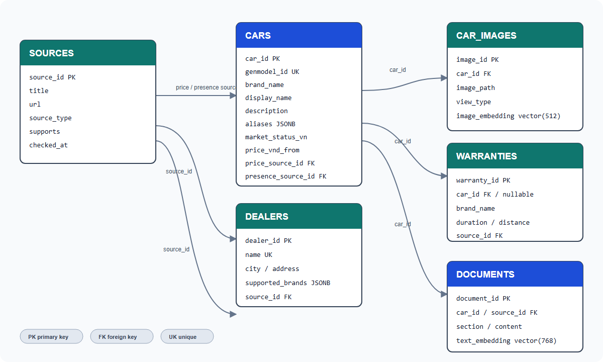

# Database Structure Review

## 1. Document information

- Database: `car_rag`
- Engine: PostgreSQL 17
- Vector extension: pgvector 0.8.6
- Schema: `public`
- Reviewed: 2026-10-01
- Source of truth: `database/001_schema.sql` and the running local database

> Filename intentionally follows the requested name `database_strucutre.md`.

## 2. Current data inventory

| Table | Current rows | Purpose |
|---|---:|---|
| `cars` | 50 | Canonical car/model records for the Vietnam MVP |
| `car_images` | 215 | Verified local images and future visual embeddings |
| `dealers` | 22 | Authorized dealer records across three major cities |
| `warranties` | 9 | Brand-level or car-specific warranty policies |
| `sources` | 61 | Provenance for presence, price, warranty, dealer and specification claims |
| `documents` | 0 | RAG chunks and future text embeddings |

Business data is stored in English. Vietnamese belongs to the presentation and chatbot response layers.

## 3. Entity relationship diagram



## 4. Table specifications

### 4.1 `sources`

Stores one provenance record for each external page, official document, dataset or market reference.

| Column | Type | Null | Notes |
|---|---|---:|---|
| `source_id` | `text` | No | Stable application-assigned primary key |
| `title` | `text` | No | Human-readable English title |
| `url` | `text` | No | External URL or repository-relative dataset path |
| `source_type` | `text` | No | Examples: `official`, `dataset`, `government`, `authorized_dealer` |
| `supports` | `text` | Yes | Scope of claims supported by this source |
| `checked_at` | `date` | No | Last project verification date |

Review notes:

- `source_type` is currently free text; a check constraint or lookup table is recommended.
- `checked_at` is a verification date, not a publication date.
- A future `archived_at` field is preferable to deleting referenced sources.

### 4.2 `cars`

Canonical model-level table used by catalogue, comparison, detail and chatbot retrieval.

| Column group | Columns | Notes |
|---|---|---|
| Identity | `car_id`, `genmodel_id` | Both are unique; `car_id` is the API identifier |
| Naming | `brand_name`, `source_model_name`, `display_name`, `aliases` | Aliases support renamed models and cross-market names |
| Content | `description`, `market_status_vn` | Description is required; status is an English code |
| Classification | `body_type`, `fuel_type`, `transmission`, `seats` | Nullable when source data is incomplete |
| Powertrain | `engine`, `engine_power_hp` | Model-level reference, not trim-specific |
| Dimensions | `length_mm`, `width_mm`, `height_mm`, `wheelbase_mm` | Integers in millimetres |
| Price | `price_vnd_from`, `price_as_of`, `price_source_id` | Vietnam reference price only |
| Warranty cache | `warranty_months`, `warranty_distance_km` | Convenience fields; policy detail lives in `warranties` |
| Provenance | `presence_source_id` | Evidence that the model is/was present in Vietnam |
| Quality | `missing_fields`, `image_count`, `updated_at` | Supports data-quality reporting |

Constraints:

- `seats > 0` when present.
- `price_vnd_from >= 0` when present.
- `price_source_id` and `presence_source_id` reference `sources`.
- Source foreign keys are deferrable to support generated seed ordering.

Current concern: one row represents a model/generation, not a market trim. Trim-specific prices and specifications must not be mixed into this record without an explicit trim model.

### 4.3 `car_images`

| Column | Type | Null | Notes |
|---|---|---:|---|
| `image_id` | `text` | No | Primary key derived from the source image identity |
| `car_id` | `text` | No | FK to `cars`, cascade delete |
| `image_path` | `text` | No | Repository or served-media path |
| `view_type` | `text` | Yes | Front/side/rear or source classification |
| `image_embedding` | `vector(512)` | Yes | Reserved for image similarity search |

No image embeddings are currently reported as populated. Add an approximate vector index only after embeddings exist and query volume justifies it.

### 4.4 `dealers`

| Column | Type | Null | Notes |
|---|---|---:|---|
| `dealer_id` | `bigserial` | No | Primary key |
| `name` | `text` | No | Currently globally unique |
| `address` | `text` | No | English/Latinized address |
| `city` | `text` | No | Currently Hanoi, Ho Chi Minh City or Da Nang |
| `phone` | `text` | Yes | Display-formatted contact number |
| `website` | `text` | Yes | Dealer or official locator URL |
| `supported_brands` | `jsonb` | No | Array of English brand names |
| `source_id` | `text` | Yes | FK to dealer provenance |
| `checked_at` | `date` | No | Verification date |

Current indexes enforce unique `name` and unique `(name, address)`. The second unique index is redundant while `name` remains globally unique.

Recommended evolution: replace `supported_brands` JSONB with `dealer_brands(dealer_id, brand_name)` if multi-brand filtering, referential integrity or admin editing becomes important.

### 4.5 `warranties`

Supports two levels:

- Car-specific policy via `car_id`.
- Brand-level fallback via `brand_name`.

The check constraint requires at least one of those fields, but currently permits both. The application must resolve car-specific policy before brand-level policy.

Recommended constraints:

```sql
CHECK ((car_id IS NOT NULL) <> (brand_name IS NOT NULL));
CHECK (duration_months IS NULL OR duration_months > 0);
CHECK (distance_limit_km IS NULL OR distance_limit_km > 0);
```

Add partial unique indexes to prevent duplicate active policies for the same car/source or brand/source.

### 4.6 `documents`

RAG storage table. It exists but currently contains zero rows.

| Column | Type | Null | Notes |
|---|---|---:|---|
| `document_id` | `text` | No | Deterministic chunk identifier |
| `car_id` | `text` | Yes | Optional owning car, cascade delete |
| `section` | `text` | No | `overview`, `specifications`, `price`, `warranty` or `dealer` |
| `content` | `text` | No | English retrieval content |
| `source_id` | `text` | Yes | Claim provenance |
| `text_embedding` | `vector(768)` | Yes | Embedding vector |
| `metadata` | `jsonb` | No | Filters and generation metadata |
| `updated_at` | `timestamptz` | No | Last generated timestamp |

Important decision: embedding dimension is fixed at 768. The selected embedding model must produce exactly 768 values, or the schema must be migrated before ingestion.

## 5. Current indexes

| Index | Type | Purpose |
|---|---|---|
| `cars_pkey` | B-tree unique | Lookup by API ID |
| `cars_genmodel_id_key` | B-tree unique | Prevent duplicate source models |
| `ix_cars_brand` | B-tree | Brand filtering |
| `ix_cars_filters` | B-tree composite | Body type, seats, fuel and price filtering |
| `ix_cars_name_search` | GIN | Simple full-text search on two name fields |
| `ix_images_car` | B-tree | Load gallery by car |
| `ux_dealers_name` | B-tree unique | Idempotent dealer upsert |
| `ux_dealers_name_address` | B-tree unique | Additional duplicate protection |
| `ix_dealers_city` | B-tree | City filtering |
| `ix_documents_car_section` | B-tree | Load RAG sections for a car |

## 6. Recommended indexes for feature implementation

Apply only after query plans are measured:

```sql
CREATE INDEX ix_cars_market_status ON cars (market_status_vn);
CREATE INDEX ix_cars_price ON cars (price_vnd_from) WHERE price_vnd_from IS NOT NULL;
CREATE INDEX ix_dealers_supported_brands ON dealers USING gin (supported_brands);
CREATE INDEX ix_warranties_car ON warranties (car_id) WHERE car_id IS NOT NULL;
CREATE INDEX ix_warranties_brand ON warranties (brand_name) WHERE brand_name IS NOT NULL;
CREATE INDEX ix_documents_source ON documents (source_id);
```

After text embeddings are populated, choose one measured vector strategy:

```sql
CREATE INDEX ix_documents_embedding_hnsw
ON documents USING hnsw (text_embedding vector_cosine_ops)
WHERE text_embedding IS NOT NULL;
```

For only a few hundred chunks, sequential vector search may be faster and simpler than maintaining an approximate index.

## 7. Search behavior

Current text search:

- Uses `ILIKE` in `CarRepository` for display name, source name and serialized aliases.
- Has a GIN full-text index that the current repository query does not use.
- Does not yet search description or normalized alias tokens efficiently.

Recommended hybrid flow:

1. Apply structured filters to `cars`.
2. Use full-text search for lexical matches.
3. Use cosine similarity for semantic document matches.
4. Merge and re-rank results.
5. Return supporting `source_id` values with each result.

## 8. Migration and seed order

Docker initialization currently applies:

1. `000_extensions.sql`
2. `001_schema.sql`
3. `seed.sql`
4. `002_add_descriptions.sql`
5. `003_enrich_missing_data.sql`
6. `004_seed_dealers.sql`
7. `005_use_curated_image_paths.sql`
8. `006_verify_seed.sql`

The final two scripts make all image records use the committed `dataset/images` paths, normalize serial sequences and fail the first-time initialization if expected row counts or required business-data invariants are not satisfied.

These initialization files run automatically only when PostgreSQL creates a new empty data volume. Existing volumes require an explicit migration command.

Recommended change before production: adopt a versioned migration tool such as FluentMigrator, DbUp or EF Core migrations instead of relying on Docker initialization order.

## 9. Backup and data integrity

- Back up the PostgreSQL volume before destructive schema changes.
- Run migrations transactionally where PostgreSQL permits.
- Validate record counts and missing-field reports after ingestion.
- Do not delete sources that are referenced by prices, warranties, dealers or documents.
- Store uploaded/generated media outside the database; retain stable paths and checksums.
- Never expose the database port publicly in production.

## 10. Review decisions requested

1. Keep `cars` at model level, or introduce `car_variants` for trim-specific data?
2. Keep `supported_brands` as JSONB, or normalize to `dealer_brands`?
3. Keep warranty cache columns on `cars`, or resolve exclusively from `warranties`?
4. Confirm the 768-dimension text embedding model before ingestion.
5. Select the production migration approach.
6. Decide whether change history uses generic audit JSON or dedicated price/status history tables.

