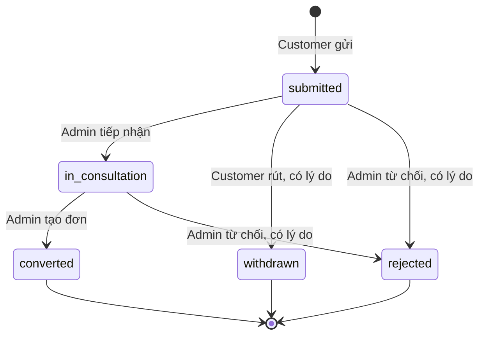

# Spec: Tài khoản và hành trình mua xe của customer

Ngày: 2026-10-03. Phiên bản: 1.1.
Trạng thái: đã triển khai C-01–C-11 trên C# và React, gồm cả các feature giai đoạn 2. C-03 và C-11 tái sử dụng module đơn hàng/trợ lý hiện có.
Tài liệu nền: [Features C#](csharp_owner_features.md).

## 1. Mục tiêu và phạm vi

Customer có một khu vực tài khoản để quản lý thông tin cá nhân, gửi yêu cầu mua xe
và theo dõi giao dịch từ lúc tư vấn đến khi bàn giao. Admin tiếp nhận yêu cầu và
tạo đơn chính thức sau khi xác nhận giá và điều kiện với khách.

**Yêu cầu mua xe** thể hiện nhu cầu tư vấn, không phải đơn đã xác nhận và không
cam kết giữ xe, giá, thời điểm bàn giao hoặc thu tiền. **Đơn mua xe** là hồ sơ giao
dịch do admin tạo với giá chốt, thanh toán và bàn giao theo nghiệp vụ hiện có.

| Phần | Ownership |
|---|---|
| Profile, mật khẩu, yêu cầu mua xe, chuyển thành đơn, audit | C# |
| Xe, đại lý, nguồn thông tin, so sánh và RAG | Python / nhóm common và RAG |
| Giao diện | React/TypeScript; tách site customer và admin |
| Database | Chung PostgreSQL `car_rag`; bảng C# trong schema `orders_service` |

C# lấy thông tin common qua HTTP API Python, không ghi vào bảng catalogue.
Tài liệu này không yêu cầu database riêng, thanh toán online, đăng ký public,
tích hợp ngân hàng, email/SMS hoặc thay đổi phần RAG.

## 2. Feature và user stories

| Mã | Feature / user story | Giai đoạn |
|---|---|---|
| C-01 | Là customer, tôi muốn xem và cập nhật thông tin cá nhân để đại lý liên hệ chính xác. | MVP mới |
| C-02 | Là customer, tôi muốn đổi mật khẩu và đăng xuất để bảo vệ tài khoản. | MVP mới; tái sử dụng logout |
| C-03 | Là customer, tôi muốn xem danh sách và chi tiết đơn của mình để theo dõi tiến độ. | Đã có nền tảng; bổ sung lối vào tài khoản |
| C-04 | Là customer, tôi muốn gửi yêu cầu mua xe để được đại lý tư vấn. | MVP mới |
| C-05 | Là customer, tôi muốn theo dõi, chỉnh sửa hoặc rút yêu cầu theo quyền được phép. | MVP mới |
| C-06 | Là admin, tôi muốn xử lý yêu cầu và chuyển thành đơn sau khi đã thống nhất với khách. | MVP mới |
| C-07 | Là customer, tôi muốn đề nghị thay đổi/hủy đơn và nhận phản hồi. | Giai đoạn 2 |
| C-08 | Là customer, tôi muốn nhận thông báo khi yêu cầu hoặc đơn có cập nhật. | Giai đoạn 2 |
| C-09 | Là customer, tôi muốn đặt lịch tư vấn/lái thử trước khi quyết định mua. | Giai đoạn 2 |
| C-10 | Là customer, tôi muốn lưu xe yêu thích để xem lại, so sánh hoặc gửi yêu cầu. | Giai đoạn 2 |
| C-11 | Là customer, tôi muốn hỏi trợ lý về đơn của mình. | Đã có MVP O-06; tái sử dụng |

## 3. Màn hình và điều hướng

| Route | Chức năng |
|---|---|
| `/account` | Tổng quan tài khoản; lối vào thông tin, bảo mật, đơn, yêu cầu và trợ lý |
| `/account/profile` | Thông tin cơ bản, cập nhật tên/số điện thoại, đăng xuất |
| `/account/security` | Đổi mật khẩu |
| `/account/orders`, `/account/orders/:id` | Danh sách/chi tiết đơn hiện có |
| `/account/purchase-requests` | Danh sách yêu cầu của customer |
| `/account/purchase-requests/new` | Gửi yêu cầu mua xe; nhận carId từ trang xe và kiểm tra lại trên server |
| `/account/purchase-requests/:id` | Chi tiết, lịch sử, sửa/rút yêu cầu và liên kết đơn được tạo |
| `/account/assistant` | Trợ lý đơn hàng hiện có |
| `/admin/purchase-requests`, `/admin/purchase-requests/:id` | Danh sách/xử lý yêu cầu cho admin |

Các trang customer không có link sang admin; các trang admin không có link sang
site customer. Truy cập URL sai vai trò chuyển về site tương ứng. API vẫn phải
kiểm tra quyền độc lập với guard frontend. Customer chưa đăng nhập được đưa tới
`/login`; sau đăng nhập quay lại route customer hợp lệ hoặc trang tổng quan tài khoản.
Không chấp nhận return URL bên ngoài website hoặc route admin từ luồng customer.

## 4. Tiêu chí nghiệm thu MVP

### C-01: Thông tin cá nhân

- Hiển thị họ tên, email đăng nhập, số điện thoại và ngày tạo tài khoản. Thiếu số điện thoại hiển thị “Chưa cập nhật”.
- Cho sửa họ tên và số điện thoại; email đăng nhập chỉ xem trong MVP.
- Họ tên sau trim dài 1–100 ký tự. Điện thoại là chuỗi, hỗ trợ số Việt Nam hoặc dạng quốc tế; chuẩn hóa phía server, không dùng kiểu số.
- Điện thoại có thể để trống trên profile, nhưng phải có số hợp lệ khi gửi yêu cầu mua xe.
- Khi lưu lỗi, giữ nội dung đã nhập; thành công hiển thị thông báo và dữ liệu mới.
- Profile chỉ cập nhật từ principal đang đăng nhập; không nhận userId tùy ý từ body.
- Đổi tên profile không sửa snapshot tên khách đã lưu trong đơn cũ. Tên trên yêu cầu cũng là snapshot tại thời điểm gửi/sửa.

### C-02: Bảo mật và đăng xuất

- Đổi mật khẩu cần mật khẩu hiện tại, mật khẩu mới và xác nhận khớp nhau.
- Mật khẩu mới dài 12–128 ký tự, khác mật khẩu hiện tại; không trim hoặc ghi mật khẩu vào log/audit.
- Server xác minh mật khẩu hiện tại, hash bằng cơ chế ASP.NET hiện có và cập nhật security stamp/version trong cùng transaction.
- Sau khi đổi thành công, tất cả cookie session cũ bị vô hiệu, kể cả phiên hiện tại; giao diện chuyển tới `/login` để đăng nhập lại.
- Mỗi request authenticated kiểm tra stamp/version với DB; chỉ tăng stamp mà không kiểm tra cookie cũ không đáp ứng tiêu chí này.
- Yêu cầu đổi mật khẩu có CSRF và rate limit theo user; lỗi không tiết lộ hash hoặc chi tiết nội bộ.
- Đăng xuất xóa cookie của phiên hiện tại, xóa state tài khoản/hội thoại trên UI và đưa về trang đăng nhập customer.
- Không làm chức năng quên mật khẩu/đổi email trong MVP vì chưa có cơ chế xác minh email và khôi phục tài khoản.

### C-03: Danh sách và chi tiết đơn

- Tái sử dụng list/detail hiện có: tìm mã, lọc trạng thái, phân trang, tiền đã thu/còn lại và lịch bàn giao.
- Customer chỉ thấy đơn của mình; đoán ID đơn khác trả 404, không tiết lộ tên xe/khách hoặc giá.
- Từ tổng quan tài khoản có thể mở đơn và trợ lý; không tự phát sinh đơn từ việc xem xe.

### C-04: Gửi yêu cầu mua xe

- Chọn xe, đại lý hỗ trợ hãng đó; phiên bản mong muốn có thể để trống. Xe/đại lý phải tồn tại theo API Python khi gửi.
- Nhập số điện thoại, cách liên hệ mong muốn (`phone` hoặc `email`), ghi chú tối đa 1000 ký tự; tên/email lấy từ tài khoản.
- Form mặc định dùng thông tin profile, nhưng thông tin liên hệ trên yêu cầu là snapshot riêng; gửi yêu cầu không tự sửa profile.
- Hiển thị rõ giá catalogue là tham khảo và yêu cầu sẽ được admin xác nhận; customer không nhập giá chốt hoặc trạng thái đơn.
- Gửi thành công tạo mã `PR-...`, trạng thái `submitted`, thời điểm gửi và event lịch sử.
- Retry cùng idempotency key/body trả cùng yêu cầu; key cũ với body khác trả 409. Không tạo thêm bản ghi khi double click.
- Python lỗi/timeout: không tạo yêu cầu thiếu snapshot, giữ form và cho thử lại.

### C-05: Theo dõi và rút yêu cầu

- List hỗ trợ tìm mã, lọc trạng thái và phân trang; detail hiển thị xe/đại lý snapshot, liên hệ, ghi chú, phản hồi và timeline.
- Customer chỉ được sửa nội dung hoặc rút khi trạng thái là `submitted`; rút cần lý do.
- Sau khi admin tiếp nhận, customer xem tiến độ và phản hồi; chưa có chức năng chat trực tiếp với nhân viên trong MVP.
- Mutation có version; dữ liệu đã thay đổi trả 409, giữ bản nháp và hướng dẫn tải lại.
- Khi `converted`, detail có link tới đơn chính thức của cùng customer.

### C-06: Admin xử lý và chuyển thành đơn

- Admin xem danh sách, lọc trạng thái, tìm mã và tiếp nhận yêu cầu; lưu admin xử lý và thời điểm.
- Admin cập nhật phản hồi cho khách hoặc từ chối có lý do; phản hồi không chứa ghi chú nội bộ/secret.
- Khi đã thống nhất, admin nhập giá chốt, cọc yêu cầu và phiên bản xác nhận; dùng quy tắc tiền/snapshot của module Orders hiện có.
- Một yêu cầu tạo tối đa một đơn. Tạo đơn, liên kết orderId, đổi sang `converted` và ghi audit trong cùng transaction.
- Convert có idempotency và khóa/version; hai admin cùng convert không tạo hai đơn.
- Đơn mới thuộc đúng customer của yêu cầu và bắt đầu ở `pending_confirmation`.
- Chuyển thành đơn không tự ghi nhận thanh toán hoặc xác nhận bàn giao.
- Sau khi convert, không sửa/rút yêu cầu; việc thay đổi đơn dùng quy trình đơn hàng.

## 5. Vòng đời yêu cầu mua xe



| Trạng thái | Nhãn UI | Hành động |
|---|---|---|
| `submitted` | Đã gửi | Customer sửa/rút; admin tiếp nhận/từ chối |
| `in_consultation` | Đang tư vấn | Admin phản hồi, từ chối hoặc chuyển thành đơn |
| `converted` | Đã tạo đơn | Chỉ đọc, mở đơn liên kết |
| `rejected` | Đã từ chối | Chỉ đọc và xem lý do |
| `withdrawn` | Khách đã rút | Chỉ đọc và xem lý do |

Không chuyển ngược trạng thái cuối trong MVP. Customer muốn mua lại tạo yêu cầu mới.
Event lưu actor, thời điểm UTC, hành động và lý do/phản hồi phù hợp; UI hiển thị theo Việt Nam.

## 6. Dữ liệu và migration

| Thành phần trong `orders_service` | Bổ sung |
|---|---|
| `users` | Phone nullable, CreatedAt, profile version và security stamp/version; giữ password hash hiện có |
| `purchase_requests` | Id, Code unique, CustomerId FK users, Status, Version, CreatedAt/UpdatedAt, AssignedAdminId nullable, OrderId nullable unique FK orders, Payload JSONB |
| Payload của yêu cầu | Snapshot xe/đại lý, phiên bản mong muốn, snapshot liên hệ, ghi chú, phản hồi và events |
| Idempotency | Tái sử dụng cơ chế hiện có sau khi mở rộng kiểu response/action cho yêu cầu và convert; không ép response mới thành Order |

Index tối thiểu: `(CustomerId, CreatedAt)`, `(Status, CreatedAt)`, unique Code và
unique OrderId khi khác null. Phần kiểm soát một yêu cầu/một đơn phải dựa trên
transaction và ràng buộc DB, không chỉ disable nút trên UI.

Migrations thêm vào DB chung; backfill CreatedAt cho tài khoản cũ phải ghi rõ là
thời điểm migration nếu ngày tạo ban đầu không tồn tại. Không giả định đó là ngày
đăng ký thật. Profile phone có thể null cho tài khoản cũ.
Seed Development thêm yêu cầu ở đủ năm trạng thái; IDs/mã ổn định, chạy lại không
nhân bản và không reset profile/mật khẩu hoặc yêu cầu đã được người dùng sửa.

## 7. API đã triển khai

Prefix: `/api/orders-service`. Các endpoint dưới đây đã được triển khai. User lấy từ cookie principal; POST/PATCH cần CSRF.

| Method/path | Quyền và mục đích |
|---|---|
| `GET /my/profile` | Customer: thông tin cá nhân |
| `PATCH /my/profile` | Customer: tên/phone và profile version |
| `POST /my/password` | Customer: mật khẩu hiện tại/mới/xác nhận |
| `POST /auth/logout` | Tái sử dụng endpoint đã có |
| `GET /my/orders`, `GET /my/orders/{id}` | Tái sử dụng endpoint đã có |
| `GET /my/purchase-requests` | Customer: list theo ownership, filters/pagination |
| `POST /my/purchase-requests` | Customer: gửi yêu cầu, idempotency |
| `GET /my/purchase-requests/{id}` | Customer: chi tiết của mình |
| `PATCH /my/purchase-requests/{id}` | Customer: sửa submitted, version/idempotency |
| `POST /my/purchase-requests/{id}/withdraw` | Customer: rút submitted, lý do/version/idempotency |
| `GET /admin/purchase-requests` | Admin: list, filters/pagination |
| `GET /admin/purchase-requests/{id}` | Admin: chi tiết |
| `POST /admin/purchase-requests/{id}/accept` | Admin: submitted → in_consultation |
| `POST /admin/purchase-requests/{id}/responses` | Admin: phản hồi khách, version/idempotency |
| `POST /admin/purchase-requests/{id}/reject` | Admin: từ chối, lý do/version/idempotency |
| `POST /admin/purchase-requests/{id}/convert` | Admin: tạo đơn từ yêu cầu, version/idempotency |

List dùng page/pageSize, pageSize tối đa 100, query tìm mã và status. Response lỗi
theo Problem Details: 401 chưa đăng nhập, 403 sai role, 404 ngoài ownership/không
tồn tại, 409 version/idempotency conflict, 422 dữ liệu/quy tắc không hợp lệ,
503 common API chưa sẵn sàng. Đổi mật khẩu hiện tại sai trả lỗi validation chung;
rate limit trả 429. Không gửi stack trace, password hoặc hash về frontend.

## 8. Feature giai đoạn 2 đã triển khai

| Feature | Hướng triển khai và điều kiện |
|---|---|
| Yêu cầu thay đổi/hủy đơn | Hồ sơ đề nghị riêng có lý do và trạng thái xử lý; admin duyệt/từ chối. Không tự thay đổi đơn hoặc sinh refund khi khách gửi. Chỉ nhận đơn chưa completed/cancelled; mỗi đơn tối đa một đề nghị pending. Duyệt đề nghị không tự đổi đơn hoặc hoàn tiền. |
| Thông báo trong ứng dụng | Sinh từ event yêu cầu/đơn, chỉ gửi user liên quan; link nội bộ, đã đọc/chưa đọc. Cùng transaction hoặc outbox để tránh thiếu/lặp; email/SMS ngoài phạm vi đầu. |
| Đặt lịch tư vấn/lái thử | Khách chọn thời gian mong muốn; đại lý xác nhận hoặc đề xuất lại. Admin mở khung giờ trong tương lai (tối đa 4 giờ) theo đại lý/nhân viên; không mở trùng khung của cùng nhân viên trong đại lý. Requested/proposed/confirmed giữ chỗ; server khóa slot và user để chống đặt trùng. Khách chấp nhận lịch đề xuất mới chuyển confirmed; chỉ hủy trước giờ bắt đầu. |
| Xe yêu thích | C# lưu userId/carId, unique cặp; thông tin hiện tại lấy Python. Xe mất khỏi catalogue có trạng thái không còn dữ liệu; không sao chép catalogue vào DB C#. |

## 9. Kiểm thử và thứ tự triển khai

1. Profile và bảo mật: migration/backfill, API, UI, đổi mật khẩu vô hiệu session cũ.
2. Customer gửi/list/detail/sửa/rút yêu cầu; tích hợp xe/đại lý Python và seed.
3. Admin tiếp nhận/phản hồi/từ chối/convert; liên kết tới đơn và audit.
4. Mở rộng đã triển khai: thông báo, đề nghị thay đổi/hủy, lịch hẹn và xe yêu thích.

Các ca nghiệm thu bắt buộc:

- Customer A không đọc/sửa/rút yêu cầu hoặc profile của B; Customer không gọi API admin.
- Admin/customer không điều hướng lẫn site; form lỗi giữ dữ liệu và không báo thành công giả.
- Mật khẩu hiện tại sai không đổi hash/stamp; đổi thành công khiến cookie cũ ở hai browser nhận 401.
- Đổi tên profile giữ nguyên snapshot đơn cũ; số điện thoại null không làm lỗi profile/list.
- Giá catalogue không trở thành giá chốt; đại lý khác hãng, Python 404/timeout không tạo yêu cầu.
- Gửi lặp cùng key không tạo hai yêu cầu; key/body khác hoặc version cũ trả 409.
- Sửa/rút trong khi admin tiếp nhận: chỉ một mutation thành công, không ghi đè dữ liệu.
- Convert đồng thời chỉ tạo một đơn; lỗi giữa transaction rollback cả đơn và liên kết yêu cầu.
- Đơn sau convert đúng customer, đúng giá/cọc, chưa có receipt hoặc bàn giao tự phát sinh.
- Seed chạy lại không nhân bản và không sửa dữ liệu đã thao tác; migration không ảnh hưởng bảng common Python.

MVP hoàn thành khi toàn bộ luồng **profile → gửi yêu cầu → admin xử lý → tạo đơn →
customer theo dõi đơn** chạy trên DB thật, checks phù hợp pass và tài liệu chạy được cập nhật.

## 10. Hợp đồng các feature mở rộng

| Route customer | Route admin |
|---|---|
| `/account/change-requests` | `/admin/change-requests` |
| `/account/appointments` | `/admin/appointments` |
| `/account/notifications` | Không có inbox customer trong site admin |
| `/account/favorites` | Không quản lý danh sách yêu thích của khách |

API dưới prefix `/api/orders-service`:

| Method/path | Hành vi |
|---|---|
| `GET /my/change-requests` | Danh sách đề nghị của principal, page/pageSize |
| `POST /my/change-requests` | `{orderId,type:change/cancel,reason}`; idempotency, chỉ đơn còn hoạt động |
| `GET /admin/change-requests` | Danh sách đề nghị cho admin |
| `POST /admin/change-requests/{id}/decision` | `{version,decision:approved/rejected,reason}`; không mutate đơn |
| `GET /my/notifications` | Inbox có phân trang theo user |
| `GET /my/notifications/unread-count` | Số chưa đọc |
| `POST /my/notifications/{id}/read` | Đọc lặp không đổi ReadAt; ngoài ownership trả 404 |
| `GET /my/appointment-slots` | Khung giờ tương lai còn trống; filter dealerId |
| `GET /admin/appointment-slots` | Các khung giờ tương lai, gồm cả đã giữ chỗ |
| `POST /admin/appointment-slots` | `{dealerId,staffName,startsAt,endsAt}`; timestamp có timezone, idempotency |
| `GET /my/appointments`, `GET /admin/appointments` | Lịch có snapshot xe, slot hiện tại, version và timeline; phân trang |
| `POST /my/appointments` | `{carId,slotId,kind:consultation/test_drive,phone,notes}`; tạo requested |
| `POST /my/appointments/{id}/actions` | `{version,action:accept/cancel,reason}` |
| `POST /admin/appointments/{id}/actions` | `{version,action:confirm/propose/reject/cancel,reason,slotId?}` |
| `GET /my/favorites` | Tối đa 100 xe; tra Python trực tiếp, unavailable nếu mất catalogue/lỗi common |
| `POST /my/favorites` | `{carId}`; unique user/car, idempotency |
| `DELETE /my/favorites/{carId}` | Bỏ yêu thích theo principal, gọi lặp an toàn |

POST/PATCH/DELETE đều cần CSRF. Mutation nghiệp vụ có `Idempotency-Key`
8–100 ký tự; replay action/body khác trả 409. Profile có optimistic version;
đổi mật khẩu có security version và rate limit 5 lần / 5 phút / user.
Lịch hẹn luôn lưu UTC và hiển thị giờ địa phương của trình duyệt.

Thông báo yêu cầu, cập nhật đơn, quyết định đề nghị và thao tác lịch của admin
được ghi cùng transaction với mutation; unique `(UserId,EventKey)` ngăn lặp.
Thông báo không gửi email/SMS. Yêu cầu/đơn/lịch của khách khác không đọc hoặc mutate được.

Migration `20261002180256_FullCustomerJourney` bổ sung users và các bảng
`purchase_requests`, `order_change_requests`, `notifications`, `appointment_slots`,
`appointments`, `favorites` trong schema `orders_service` của DB **car_rag**.
Tài khoản cũ được backfill CreatedAt tại migration và CreatedAtEstimated=true;
tài khoản mới ghi ngày thật và false. Profile/security version khởi đầu là 1.
Bảng common Python giữ nguyên.

Seed development thêm 5 yêu cầu PR-DEMO-0001..0005 ở đủ năm trạng thái,
đơn AW-REQUEST-DEMO-0001 liên kết yêu cầu converted, 4 slot, một lịch requested,
một đề nghị pending và một thông báo. IDs ổn định; restart bỏ qua bản ghi đã có,
không reset password/profile hay thao tác của user. Xe yêu thích do user tự lưu,
không tự thêm lại khi đã bỏ yêu thích. Slot seed đã qua không tự dời ngày;
admin mở slot mới nếu cần demo ở ngày sau.

## 11. Chạy và kiểm tra

```powershell
docker compose up --build -d
# Chờ /api/orders-service/health trả 200 rồi chạy smoke.
dotnet test services/owner-features/AutoWise.OwnerFeatures.sln
python services/owner-features/tests/smoke_customer_journey.py
python services/owner-features/tests/smoke_orders.py
python services/owner-features/tests/smoke_assistant.py
# Chạy cuối, khi không còn browser/client test đang mở: restart và kiểm tra seed.
python services/owner-features/tests/smoke_seed.py
cd frontend
npm run build
```

Customer: `http://localhost:5173/login`, customer1@autowise.test / DemoCustomer!2026,
vào `/account`. Admin: `/admin/login`, admin@autowise.test / DemoAdmin!2026.
Hai site có menu riêng; nhập URL sai vai trò vẫn bị chuyển về site tương ứng.
Form mua xe có tìm kiếm catalogue và preselect carId từ trang xe.
Chi tiết xe có nút lưu yêu thích và gửi yêu cầu; đơn đang hoạt động có nút đề nghị thay đổi/hủy.

Smoke journey cần httpx, tạo tài khoản/giao dịch **giả riêng** mỗi lần chạy;
không đổi mật khẩu tài khoản demo chung. Kiểm tra optimistic conflict, CSRF,
ownership, snapshot, retry, race sửa/tiếp nhận, convert đồng thời, rollback giá
không hợp lệ, đề nghị, favorites, race slot, lịch đề xuất/chấp nhận, read notification
và vô hiệu cookie cũ ở hai client. Chờ ít nhất một phút giữa nhiều bộ smoke
đăng nhập liên tiếp nếu chạm rate limit login 10 lần/phút theo IP.

Smoke UI: `node services/owner-features/tests/smoke_customer_ui.cjs`, cần Playwright
trong môi trường Node và Edge; có thể đặt UI_BROWSER_CHANNEL theo browser đã cài.
Dùng browser profile mới, không dùng session cá nhân. Chạy từ root repo;
script tạo một yêu cầu và đơn demo, kiểm tra form/route/mobile và chụp ảnh vào docs.

Phạm vi vẫn chưa có đăng ký public, quên mật khẩu, email/SMS, thanh toán online,
RAG mới hoặc tự động refund/đổi đơn từ việc duyệt đề nghị. Các mục này ngoài spec.

Kết quả xác minh local: 34 unit tests C# pass, frontend production build pass,
smoke journey/Orders/Assistant pass, EF không còn pending model changes.
Smoke seed đã xác minh restart không tăng số bản ghi và không reset profile,
security version, trạng thái yêu cầu hoặc liên kết đơn. Smoke UI xác minh customer/admin
conversion, returnTo sau login, form lỗi giữ dữ liệu, mobile không tràn ngang và
không có React runtime error.

Ảnh giao diện: [Customer desktop](customer-account-preview.png),
[Customer mobile](customer-account-mobile.png), [Admin xử lý yêu cầu](customer-request-admin-preview.png).
